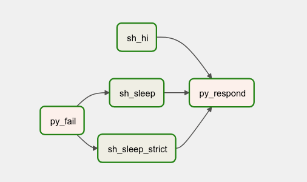

# airflow-tutorial

## Simple DAG
- DAG runs every 30min  
- `py_fail` will fail at 0min (divide by 0 error)
- `sh_sleep_strict` will not run when `py_fail` fails
- `sh_sleep` will run regardless of `py_fail` status
- `sh_hi` is another job independent of the rest
- `py_respond` will run when all it's dependency is done

